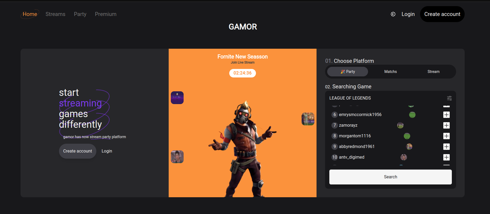

# Proyecto Gamor React + Tailwind CSS + TypeScript



> Osvaldo R. Moreno Prieto. 2023. Proyecto para evaluar los conocimientos alcanzados en frontend

Para ejecutar el proyecto:

```bash
npm install -g serve
serve -s build
```

[Orientación del Proyecto](./Orientacion.md)

[Documento de Figma](https://www.figma.com/file/AMZB4c8u8KZXvffNQCFT8q/Gamor?type=design&node-id=0%3A1&mode=design&t=hMyUiJzlSoLXXKKd-1)

[Old Readme default react](./OldReadme.md)
